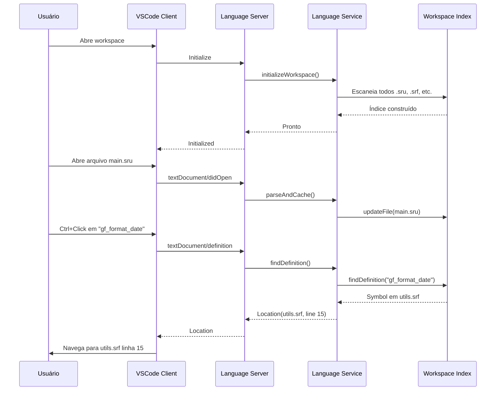
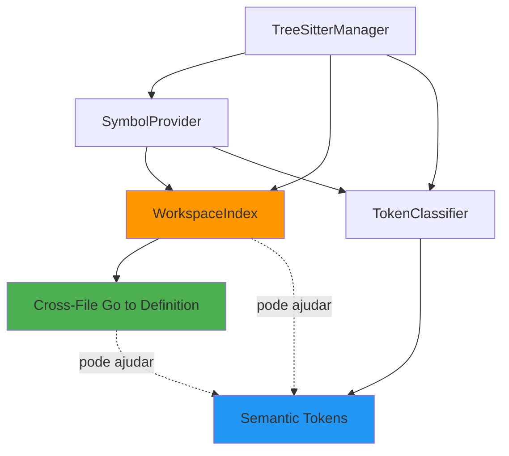

# Análise Técnica e Plano de Implementação
## PowerBuilder Language Server Protocol (LSP)

**Data:** 22 de Outubro de 2025  
**Repositório:** https://github.com/pb-shrugged/powerbuilder-language-support

---

## 📊 1. Estado Atual do Projeto

### 1.1 Visão Geral

O projeto é um **Language Server Protocol (LSP)** completo para PowerBuilder, implementado em TypeScript, utilizando Tree-sitter para análise sintática. A arquitetura segue um padrão de monorepo com separação clara de responsabilidades.

### 1.2 Arquitetura Atual

```
powerbuilder-language-support/
├── packages/
│   ├── pb-language-logger/          # Sistema de logging (Winston)
│   ├── pb-language-service/         # Biblioteca core (agnóstica ao VSCode)
│   │   ├── parser/                  # Tree-sitter manager + cache
│   │   ├── symbols/                 # Provedor de símbolos
│   │   ├── features/                # Implementação de features LSP
│   │   └── utils/                   # Utilitários AST
│   └── pb-language-server/          # Servidor LSP (camada fina)
└── vscode-client/                   # Extensão VSCode
```

### 1.3 Funcionalidades Implementadas ✅

| Funcionalidade | Status | Escopo | Qualidade |
|---------------|--------|--------|-----------|
| **Diagnostics** | ✅ Implementado | Validação de sintaxe em tempo real | ⭐⭐⭐⭐ |
| **Hover** | ✅ Implementado | Exibe informações sobre símbolos | ⭐⭐⭐⭐ |
| **Go to Definition** | ✅ Implementado | **Apenas mesmo arquivo** | ⭐⭐⭐ |
| **Document Symbols** | ✅ Implementado | Lista símbolos top-level | ⭐⭐⭐⭐ |
| **Parsing Incremental** | ✅ Implementado | Atualizações eficientes via Tree-sitter | ⭐⭐⭐⭐⭐ |
| **Debouncing** | ✅ Implementado | 300ms para validações | ⭐⭐⭐⭐ |

### 1.4 Tecnologias Utilizadas

- **TypeScript 5.3+**: Linguagem principal
- **Tree-sitter 0.25.0**: Parser incremental de alto desempenho
- **@pb-shrugged/tree-sitter-powerbuilder 2.0.4**: Gramática PowerBuilder
- **vscode-languageserver 9.0.1**: Implementação do protocolo LSP
- **vscode-languageclient 9.0.1**: Cliente LSP para VSCode
- **Winston 3.18.3**: Sistema de logging
- **Jest 29.5.0**: Framework de testes

### 1.5 Pontos Fortes da Implementação Atual

1. **✅ Arquitetura Bem Estruturada**
   - Separação clara entre service, server e client
   - Biblioteca core agnóstica ao VSCode (reutilizável)
   
2. **✅ Parsing Eficiente**
   - Tree-sitter com parsing incremental
   - Cache de ASTs por documento
   - Sincronização incremental de mudanças

3. **✅ Sistema de Símbolos Robusto**
   - Extração de funções, variáveis, tipos e eventos
   - Navegação pela árvore AST
   - Suporte a informações detalhadas (assinaturas de funções)

4. **✅ Testes Unitários**
   - Cobertura de funcionalidades principais
   - Testes isolados com Jest

### 1.6 Limitações Identificadas

1. **❌ Go to Definition - Apenas Mesmo Arquivo**
   - Código atual em `features/definition.ts` (linha 9-24):
   ```typescript
   export function findDefinition(
     uri: string,
     tree: Parser.Tree,
     position: Position,
     symbolProvider: SymbolProvider,
   ): Location | null {
     const symbol = symbolProvider.findDefinitionAtPosition(tree, position);
     if (!symbol) return null;
     
     // ⚠️ PROBLEMA: Sempre retorna o URI atual
     return {
       uri,  // <- URI do arquivo atual, não do arquivo onde o símbolo está definido
       range: symbol.selectionRange,
     };
   }
   ```
   - **Impacto**: Desenvolvedores não conseguem navegar entre arquivos PowerBuilder

2. **❌ Sem Syntax Highlighting via Language Server**
   - Apenas configuração básica em `language-configuration.json`
   - Nenhuma implementação de semantic tokens
   - **Impacto**: Experiência visual limitada, sem destaque semântico

3. **❌ Sem Sistema de Indexação de Workspace**
   - `TreeSitterManager` mantém apenas documentos abertos em cache
   - Nenhum índice global de símbolos do workspace
   - **Impacto**: Impossibilidade de buscar símbolos em arquivos não abertos

---

## 🎯 2. Plano Técnico: Cross-File "Go to Definition"

### 2.1 Análise do Problema

**Comportamento Atual:**
```typescript
// Em symbol-provider.ts, linha 40-54
public findDefinitionAtPosition(tree: Parser.Tree, position: Position): Symbol | null {
  const symbols = this.getAllSymbols(tree); // ⚠️ Apenas símbolos do arquivo atual
  const node = this.findNodeAtPosition(tree.rootNode, position);
  if (!node) return null;
  
  const identifierText = getNodeText(node);
  const matchingSymbol = symbols.find((s) => s.name === identifierText);
  return matchingSymbol || null; // ⚠️ Retorna apenas se encontrado localmente
}
```

**Cenários que Precisamos Suportar:**

1. **Referência a função global de outro arquivo (.srf)**
   ```powerbuilder
   // Arquivo: uo_main.sru
   string ls_result
   ls_result = gf_format_date(today()) // gf_format_date definida em nf_utils.srf
   ```

2. **Referência a objeto de outro arquivo (.sru)**
   ```powerbuilder
   // Arquivo: w_main.srw
   uo_customer luo_cust
   luo_cust = create uo_customer // uo_customer definido em uo_customer.sru
   ```

3. **Herança de objetos**
   ```powerbuilder
   // Arquivo: uo_employee.sru
   global type uo_employee from uo_person // uo_person em uo_person.sru
   ```

### 2.2 Solução Proposta: Workspace Symbol Index

#### 2.2.1 Nova Arquitetura de Componentes

```
packages/pb-language-service/src/
├── workspace/
│   ├── workspace-index.ts          # Índice global de símbolos
│   ├── workspace-scanner.ts        # Scanner de arquivos do workspace
│   └── symbol-index.ts             # Estrutura de dados do índice
├── symbols/
│   └── symbol-provider.ts          # MODIFICADO: Busca no índice
└── features/
    └── definition.ts                # MODIFICADO: Busca cross-file
```

#### 2.2.2 Estrutura do Índice de Símbolos

```typescript
// workspace/symbol-index.ts

export interface IndexedSymbol {
  name: string;                     // Nome do símbolo (ex: "gf_format_date")
  kind: SymbolKind;                 // Function, Variable, Class, etc.
  uri: string;                      // URI do arquivo onde está definido
  range: Range;                     // Posição no arquivo
  selectionRange: Range;            // Range do nome
  detail?: string;                  // Assinatura ou tipo
  scope?: SymbolScope;              // global, public, private, protected
}

export enum SymbolScope {
  Global = 'global',
  Public = 'public',
  Private = 'private',
  Protected = 'protected',
}

export class SymbolIndex {
  // Índice principal: nome -> símbolos
  private symbolsByName: Map<string, IndexedSymbol[]>;
  
  // Índice secundário: URI -> símbolos do arquivo
  private symbolsByUri: Map<string, IndexedSymbol[]>;
  
  // Métodos
  addSymbol(symbol: IndexedSymbol): void;
  removeSymbolsByUri(uri: string): void;
  findSymbolsByName(name: string): IndexedSymbol[];
  findGlobalSymbol(name: string): IndexedSymbol | null;
  getSymbolsInUri(uri: string): IndexedSymbol[];
  clear(): void;
}
```

#### 2.2.3 Workspace Scanner

```typescript
// workspace/workspace-scanner.ts

export class WorkspaceScanner {
  private treeSitterManager: TreeSitterManager;
  private symbolProvider: SymbolProvider;
  
  /**
   * Escaneia todos os arquivos PowerBuilder no workspace
   */
  async scanWorkspace(rootPath: string): Promise<IndexedSymbol[]> {
    const pbFiles = await this.findPowerBuilderFiles(rootPath);
    const symbols: IndexedSymbol[] = [];
    
    for (const file of pbFiles) {
      const fileSymbols = await this.scanFile(file);
      symbols.push(...fileSymbols);
    }
    
    return symbols;
  }
  
  /**
   * Escaneia um único arquivo
   */
  async scanFile(uri: string): Promise<IndexedSymbol[]> {
    const text = await fs.readFile(URI.parse(uri).fsPath, 'utf-8');
    const tree = this.treeSitterManager.parseAndCache(uri, text, 0);
    const symbols = this.symbolProvider.getDocumentSymbols(tree);
    
    // Converte Symbol[] para IndexedSymbol[]
    return symbols.map(s => ({
      ...s,
      uri,
      scope: this.determineScope(s),
    }));
  }
  
  private async findPowerBuilderFiles(rootPath: string): Promise<string[]> {
    // Usa glob para encontrar *.sra, *.srf, *.srs, *.sru, *.srw, *.srm
    const patterns = ['**/*.sra', '**/*.srf', '**/*.srs', '**/*.sru', '**/*.srw', '**/*.srm'];
    // Implementação com fast-glob ou similar
  }
}
```

#### 2.2.4 Workspace Index Manager

```typescript
// workspace/workspace-index.ts

export class WorkspaceIndex {
  private index: SymbolIndex;
  private scanner: WorkspaceScanner;
  private fileWatcher?: FileWatcher;
  private isIndexing: boolean = false;
  
  constructor(
    private treeSitterManager: TreeSitterManager,
    private symbolProvider: SymbolProvider,
  ) {
    this.index = new SymbolIndex();
    this.scanner = new WorkspaceScanner(treeSitterManager, symbolProvider);
  }
  
  /**
   * Inicializa o índice com scan inicial
   */
  async initialize(workspaceFolders: string[]): Promise<void> {
    this.isIndexing = true;
    
    for (const folder of workspaceFolders) {
      const symbols = await this.scanner.scanWorkspace(folder);
      symbols.forEach(s => this.index.addSymbol(s));
    }
    
    this.isIndexing = false;
    this.setupFileWatcher(workspaceFolders);
  }
  
  /**
   * Atualiza o índice quando um arquivo muda
   */
  async updateFile(uri: string): Promise<void> {
    // Remove símbolos antigos do arquivo
    this.index.removeSymbolsByUri(uri);
    
    // Re-escaneia e adiciona novos símbolos
    const symbols = await this.scanner.scanFile(uri);
    symbols.forEach(s => this.index.addSymbol(s));
  }
  
  /**
   * Busca cross-file por nome
   */
  findDefinition(name: string, currentUri: string): IndexedSymbol | null {
    // 1. Busca no arquivo atual primeiro (prioridade)
    const localSymbols = this.index.getSymbolsInUri(currentUri);
    const localMatch = localSymbols.find(s => s.name === name);
    if (localMatch) return localMatch;
    
    // 2. Busca global no workspace
    return this.index.findGlobalSymbol(name);
  }
}
```

#### 2.2.5 Modificações em PowerBuilderLanguageService

```typescript
// index.ts - MODIFICAÇÕES

export class PowerBuilderLanguageService {
  private treeSitterManager: TreeSitterManager;
  private symbolProvider: SymbolProvider;
  private workspaceIndex: WorkspaceIndex; // NOVO

  constructor() {
    this.treeSitterManager = new TreeSitterManager();
    this.symbolProvider = new SymbolProvider();
    this.workspaceIndex = new WorkspaceIndex(
      this.treeSitterManager,
      this.symbolProvider,
    ); // NOVO
  }

  // NOVO: Inicializa o workspace index
  async initializeWorkspace(workspaceFolders: string[]): Promise<void> {
    await this.workspaceIndex.initialize(workspaceFolders);
  }

  // MODIFICADO: Atualiza também o índice
  parseAndCache(uri: string, text: string, version: number): void {
    this.treeSitterManager.parseAndCache(uri, text, version);
    this.workspaceIndex.updateFile(uri); // NOVO
  }

  // MODIFICADO: Busca cross-file
  findDefinition(uri: string, position: Position): Location | null {
    const tree = this.treeSitterManager.getTree(uri);
    if (!tree) return null;
    
    // 1. Encontra o identificador na posição
    const node = this.symbolProvider.findNodeAtPosition(tree.rootNode, position);
    if (!node) return null;
    
    const identifierText = getNodeText(node);
    
    // 2. Busca cross-file usando o workspace index
    const symbol = this.workspaceIndex.findDefinition(identifierText, uri);
    if (!symbol) return null;
    
    return {
      uri: symbol.uri,        // AGORA pode ser outro arquivo!
      range: symbol.selectionRange,
    };
  }
}
```

#### 2.2.6 Modificações no Language Server

```typescript
// packages/pb-language-server/src/server/server.ts - MODIFICAÇÕES

export default class PowerBuilderServer {
  // ...
  
  private async onInitialized() {
    this.initialized = true;
    
    // NOVO: Inicializa o workspace index
    const workspaceFolders = await this.connection.workspace.getWorkspaceFolders();
    if (workspaceFolders) {
      const folders = workspaceFolders.map(f => URI.parse(f.uri).fsPath);
      await this.powerbuilderLanguageService.initializeWorkspace(folders);
      logger.getLogger().info(`Workspace indexed: ${folders.length} folder(s)`);
    }
    
    logger.getLogger().info('PowerBuilder Language Server initialized!');
  }
}
```

### 2.3 Fluxo de Execução



### 2.4 Otimizações e Considerações

#### 2.4.1 Performance

1. **Indexação Inicial Assíncrona**
   - Não bloquear a inicialização do servidor
   - Mostrar progresso ao usuário
   - Features funcionam parcialmente durante indexação

2. **Debouncing de Atualizações**
   - Evitar re-indexação frequente durante edição rápida
   - Usar mesmo mecanismo de debounce dos diagnostics (300ms)

3. **Indexação Incremental**
   - Apenas re-escanear arquivos modificados
   - Manter cache de hash de arquivos para detectar mudanças

4. **Lazy Loading**
   - Não carregar conteúdo completo de arquivos fechados
   - Apenas parsear e extrair símbolos top-level

#### 2.4.2 Precisão

1. **Resolução de Escopo**
   ```powerbuilder
   // Prioridade de busca:
   // 1. Variáveis locais (função atual)
   // 2. Variáveis de instância (objeto atual)
   // 3. Funções/variáveis públicas do objeto atual
   // 4. Funções globais do workspace
   ```

2. **Ambiguidade de Nomes**
   - Quando múltiplos símbolos têm o mesmo nome
   - Preferir: global functions > public functions > local definitions
   - Mostrar lista se necessário (LSP suporta multiple locations)

3. **Case Sensitivity**
   - PowerBuilder é case-insensitive
   - Normalizar nomes para lowercase na busca

### 2.5 Dependências Adicionais

```json
// package.json - Novas dependências
{
  "dependencies": {
    "fast-glob": "^3.3.2",        // Scanner de arquivos eficiente
    "chokidar": "^3.5.3"          // File watcher cross-platform
  }
}
```

---

## 🎨 3. Plano Técnico: Syntax Highlighting via Language Server

### 3.1 Análise do Problema

**Estado Atual:**
- Apenas configuração básica em `language-configuration.json`
- Nenhuma coloração semântica (semantic tokens)
- Limitado a syntax highlighting estático do VSCode

**O que falta:**
1. **Semantic Token Provider**: Coloração baseada em significado (não apenas sintaxe)
2. **Diferenciação de Tipos**: Funções globais vs. locais, tipos built-in vs. custom
3. **Escopo Visual**: Diferentes cores para variáveis de instância vs. locais

### 3.2 Entendendo Semantic Tokens no LSP

O LSP oferece o capability `textDocument/semanticTokens` que permite:
- **Token Types**: function, variable, class, parameter, property, etc.
- **Token Modifiers**: declaration, definition, readonly, static, deprecated, etc.
- **Delta Updates**: Enviar apenas mudanças, não todo o documento

**Vantagens sobre TextMate Grammar:**
- ✅ Baseado em análise semântica, não regex
- ✅ Entende contexto e escopo
- ✅ Pode diferenciar uso vs. definição
- ✅ Sincronizado com parsing do LSP

### 3.3 Solução Proposta: Semantic Tokens Provider

#### 3.3.1 Nova Arquitetura de Componentes

```
packages/pb-language-service/src/
├── features/
│   └── semantic-tokens.ts          # NOVO: Provider de tokens semânticos
└── symbols/
    └── token-classifier.ts          # NOVO: Classificador de tokens
```

#### 3.3.2 Definição de Token Types e Modifiers

```typescript
// features/semantic-tokens.ts

/**
 * Token types suportados pelo PowerBuilder LSP
 * Baseados no LSP SemanticTokenTypes padrão + custom
 */
export enum PBTokenType {
  // Standard LSP types
  Namespace = 0,
  Type = 1,
  Class = 2,
  Enum = 3,
  Interface = 4,
  Struct = 5,
  TypeParameter = 6,
  Parameter = 7,
  Variable = 8,
  Property = 9,
  EnumMember = 10,
  Event = 11,
  Function = 12,
  Method = 13,
  Macro = 14,
  Keyword = 15,
  Modifier = 16,
  Comment = 17,
  String = 18,
  Number = 19,
  Regexp = 20,
  Operator = 21,
}

/**
 * Token modifiers para adicionar informação contextual
 */
export enum PBTokenModifier {
  Declaration = 0,      // Definição do símbolo
  Definition = 1,       // Implementação
  Readonly = 2,         // Constante
  Static = 3,           // Membro estático
  Deprecated = 4,       // Obsoleto
  Abstract = 5,         // Abstrato
  Async = 6,            // Assíncrono
  Modification = 7,     // Sendo modificado
  Documentation = 8,    // Comentário de documentação
  DefaultLibrary = 9,   // Função built-in do PowerBuilder
}

/**
 * Legenda de tokens para o cliente
 */
export const TOKEN_TYPES_LEGEND = [
  'namespace', 'type', 'class', 'enum', 'interface',
  'struct', 'typeParameter', 'parameter', 'variable', 'property',
  'enumMember', 'event', 'function', 'method', 'macro',
  'keyword', 'modifier', 'comment', 'string', 'number',
  'regexp', 'operator',
];

export const TOKEN_MODIFIERS_LEGEND = [
  'declaration', 'definition', 'readonly', 'static', 'deprecated',
  'abstract', 'async', 'modification', 'documentation', 'defaultLibrary',
];
```

#### 3.3.3 Token Classifier

```typescript
// symbols/token-classifier.ts

export interface SemanticToken {
  line: number;
  startChar: number;
  length: number;
  tokenType: PBTokenType;
  tokenModifiers: number; // Bitmask de modifiers
}

export class TokenClassifier {
  /**
   * Classifica todos os tokens em um documento
   */
  public classifyDocument(tree: Parser.Tree, text: string): SemanticToken[] {
    const tokens: SemanticToken[] = [];
    
    this.visitNode(tree.rootNode, tokens, text);
    
    // Ordena tokens por posição (linha, coluna)
    return tokens.sort((a, b) => {
      if (a.line !== b.line) return a.line - b.line;
      return a.startChar - b.startChar;
    });
  }
  
  /**
   * Visita recursivamente nós da AST
   */
  private visitNode(
    node: Parser.SyntaxNode,
    tokens: SemanticToken[],
    text: string,
  ): void {
    const token = this.classifyNode(node, text);
    if (token) {
      tokens.push(token);
    }
    
    for (const child of node.namedChildren) {
      this.visitNode(child, tokens, text);
    }
  }
  
  /**
   * Classifica um nó individual
   */
  private classifyNode(node: Parser.SyntaxNode, text: string): SemanticToken | null {
    const type = node.type;
    
    // Keywords
    if (this.isKeyword(type)) {
      return this.createToken(node, PBTokenType.Keyword, 0);
    }
    
    // Function declaration
    if (type === 'function_declaration' || type === 'function_definition') {
      const nameNode = node.childForFieldName('name');
      if (nameNode) {
        let modifiers = 0;
        
        // Detecta se é global function
        if (this.isGlobalFunction(node)) {
          modifiers |= (1 << PBTokenModifier.DefaultLibrary);
        }
        
        // Detecta declaração vs. definição
        if (type === 'function_declaration') {
          modifiers |= (1 << PBTokenModifier.Declaration);
        } else {
          modifiers |= (1 << PBTokenModifier.Definition);
        }
        
        return this.createToken(nameNode, PBTokenType.Function, modifiers);
      }
    }
    
    // Variable declaration
    if (type === 'variable_declaration' || type === 'variable_definition') {
      const nameNode = node.childForFieldName('name');
      if (nameNode) {
        let modifiers = 0;
        
        // Detecta constantes
        if (this.isConstant(node)) {
          modifiers |= (1 << PBTokenModifier.Readonly);
        }
        
        return this.createToken(nameNode, PBTokenType.Variable, modifiers);
      }
    }
    
    // Type/Class declaration
    if (type === 'type_declaration' || type === 'object_declaration') {
      const nameNode = node.childForFieldName('name');
      if (nameNode) {
        const modifiers = (1 << PBTokenModifier.Declaration);
        return this.createToken(nameNode, PBTokenType.Class, modifiers);
      }
    }
    
    // Event declaration
    if (type === 'event_declaration') {
      const nameNode = node.childForFieldName('name');
      if (nameNode) {
        return this.createToken(nameNode, PBTokenType.Event, 0);
      }
    }
    
    // Property access (variable instance)
    if (type === 'member_access' || type === 'property_access') {
      const memberNode = node.childForFieldName('member');
      if (memberNode) {
        return this.createToken(memberNode, PBTokenType.Property, 0);
      }
    }
    
    // Comments
    if (type === 'comment' || type === 'line_comment' || type === 'block_comment') {
      return this.createToken(node, PBTokenType.Comment, 0);
    }
    
    // Strings
    if (type === 'string_literal' || type === 'string') {
      return this.createToken(node, PBTokenType.String, 0);
    }
    
    // Numbers
    if (type === 'number_literal' || type === 'integer' || type === 'decimal') {
      return this.createToken(node, PBTokenType.Number, 0);
    }
    
    return null;
  }
  
  /**
   * Cria um token semântico
   */
  private createToken(
    node: Parser.SyntaxNode,
    tokenType: PBTokenType,
    tokenModifiers: number,
  ): SemanticToken {
    return {
      line: node.startPosition.row,
      startChar: node.startPosition.column,
      length: node.endPosition.column - node.startPosition.column,
      tokenType,
      tokenModifiers,
    };
  }
  
  /**
   * Helpers para detectar contexto
   */
  private isKeyword(type: string): boolean {
    const keywords = [
      'function', 'end', 'if', 'then', 'else', 'elseif', 'for', 'next',
      'do', 'loop', 'while', 'until', 'return', 'exit', 'continue',
      'choose', 'case', 'type', 'forward', 'global', 'public', 'private',
      'protected', 'constant', 'readonly', 'static', 'create', 'destroy',
    ];
    return keywords.includes(type.toLowerCase());
  }
  
  private isGlobalFunction(node: Parser.SyntaxNode): boolean {
    // Verifica se a função tem modificador 'global'
    const modifiers = node.childForFieldName('modifiers');
    if (modifiers) {
      return modifiers.text.includes('global');
    }
    return false;
  }
  
  private isConstant(node: Parser.SyntaxNode): boolean {
    const modifiers = node.childForFieldName('modifiers');
    if (modifiers) {
      const text = modifiers.text.toLowerCase();
      return text.includes('constant') || text.includes('readonly');
    }
    return false;
  }
}
```

#### 3.3.4 Semantic Tokens Feature Provider

```typescript
// features/semantic-tokens.ts

import Parser from 'tree-sitter';
import { SemanticTokens } from 'vscode-languageserver-types';
import { TokenClassifier } from '../symbols/token-classifier';

/**
 * Provê semantic tokens para um documento
 */
export function provideSemanticTokens(
  tree: Parser.Tree,
  text: string,
  classifier: TokenClassifier,
): SemanticTokens {
  const tokens = classifier.classifyDocument(tree, text);
  
  // Converte tokens para formato LSP (delta encoding)
  const data = encodeSemanticTokens(tokens);
  
  return { data };
}

/**
 * Converte tokens para formato LSP com delta encoding
 * 
 * Formato: [deltaLine, deltaStartChar, length, tokenType, tokenModifiers]
 * - deltaLine: diferença de linha desde o token anterior (0 para mesma linha)
 * - deltaStartChar: diferença de coluna desde o token anterior (ou da linha se nova linha)
 * - length: comprimento do token
 * - tokenType: índice do tipo de token
 * - tokenModifiers: bitmask de modifiers
 */
function encodeSemanticTokens(tokens: SemanticToken[]): number[] {
  const data: number[] = [];
  let prevLine = 0;
  let prevChar = 0;
  
  for (const token of tokens) {
    const deltaLine = token.line - prevLine;
    const deltaChar = deltaLine === 0 ? token.startChar - prevChar : token.startChar;
    
    data.push(
      deltaLine,
      deltaChar,
      token.length,
      token.tokenType,
      token.tokenModifiers,
    );
    
    prevLine = token.line;
    prevChar = token.startChar;
  }
  
  return data;
}

/**
 * Provê semantic tokens para um range específico (otimização)
 */
export function provideSemanticTokensRange(
  tree: Parser.Tree,
  text: string,
  range: Range,
  classifier: TokenClassifier,
): SemanticTokens {
  const allTokens = classifier.classifyDocument(tree, text);
  
  // Filtra tokens apenas no range solicitado
  const rangeTokens = allTokens.filter(token => 
    token.line >= range.start.line && token.line <= range.end.line
  );
  
  const data = encodeSemanticTokens(rangeTokens);
  return { data };
}
```

#### 3.3.5 Modificações em PowerBuilderLanguageService

```typescript
// index.ts - MODIFICAÇÕES

export class PowerBuilderLanguageService {
  private treeSitterManager: TreeSitterManager;
  private symbolProvider: SymbolProvider;
  private tokenClassifier: TokenClassifier; // NOVO

  constructor() {
    this.treeSitterManager = new TreeSitterManager();
    this.symbolProvider = new SymbolProvider();
    this.tokenClassifier = new TokenClassifier(); // NOVO
  }

  // NOVO: Provê semantic tokens para documento completo
  provideSemanticTokens(uri: string): SemanticTokens | null {
    const tree = this.treeSitterManager.getTree(uri);
    const text = this.treeSitterManager.getText(uri);
    
    if (!tree || !text) {
      return null;
    }
    
    return provideSemanticTokens(tree, text, this.tokenClassifier);
  }

  // NOVO: Provê semantic tokens para um range (otimização)
  provideSemanticTokensRange(uri: string, range: Range): SemanticTokens | null {
    const tree = this.treeSitterManager.getTree(uri);
    const text = this.treeSitterManager.getText(uri);
    
    if (!tree || !text) {
      return null;
    }
    
    return provideSemanticTokensRange(tree, text, range, this.tokenClassifier);
  }
}
```

#### 3.3.6 Modificações no Language Server

```typescript
// packages/pb-language-server/src/server/server.ts - MODIFICAÇÕES

import {
  SemanticTokensBuilder,
  SemanticTokensOptions,
} from 'vscode-languageserver/node';

export default class PowerBuilderServer {
  // ...
  
  /**
   * LSP capabilities supported by the server
   */
  public getCapabilities(): LSP.ServerCapabilities {
    return {
      textDocumentSync: {
        openClose: true,
        change: LSP.TextDocumentSyncKind.Incremental,
        save: { includeText: false },
      },
      hoverProvider: true,
      definitionProvider: true,
      documentSymbolProvider: true,
      
      // NOVO: Semantic tokens capability
      semanticTokensProvider: {
        legend: {
          tokenTypes: TOKEN_TYPES_LEGEND,
          tokenModifiers: TOKEN_MODIFIERS_LEGEND,
        },
        range: true,      // Suporta range requests
        full: {
          delta: false,   // Pode adicionar delta updates depois
        },
      },
    };
  }
  
  /**
   * Register handlers
   */
  public register(connection: LSP.Connection): void {
    // ... handlers existentes
    
    // NOVO: Semantic tokens handlers
    this.connection.languages.semanticTokens.on(
      this.onSemanticTokensFull.bind(this)
    );
    this.connection.languages.semanticTokens.onRange(
      this.onSemanticTokensRange.bind(this)
    );
  }
  
  // NOVO: Handler para semantic tokens (documento completo)
  private onSemanticTokensFull(params: LSP.SemanticTokensParams) {
    try {
      const tokens = this.powerbuilderLanguageService.provideSemanticTokens(
        params.textDocument.uri
      );
      return tokens;
    } catch (error) {
      logger.getLogger().error(`Error providing semantic tokens: ${error}`);
      return null;
    }
  }
  
  // NOVO: Handler para semantic tokens (range específico)
  private onSemanticTokensRange(params: LSP.SemanticTokensRangeParams) {
    try {
      const tokens = this.powerbuilderLanguageService.provideSemanticTokensRange(
        params.textDocument.uri,
        params.range
      );
      return tokens;
    } catch (error) {
      logger.getLogger().error(`Error providing semantic tokens range: ${error}`);
      return null;
    }
  }
}
```

### 3.4 Customização de Cores no VSCode

Usuários podem customizar cores dos tokens em `.vscode/settings.json`:

```json
{
  "editor.semanticTokenColorCustomizations": {
    "enabled": true,
    "rules": {
      // Funções globais em cor diferente
      "function.defaultLibrary": {
        "foreground": "#4EC9B0",
        "fontStyle": "bold"
      },
      
      // Variáveis de instância
      "property": {
        "foreground": "#9CDCFE"
      },
      
      // Constantes
      "variable.readonly": {
        "foreground": "#4FC1FF",
        "fontStyle": "italic"
      },
      
      // Tipos/Classes
      "class.declaration": {
        "foreground": "#4EC9B0",
        "fontStyle": "bold"
      },
      
      // Keywords
      "keyword": {
        "foreground": "#C586C0",
        "fontStyle": "bold"
      }
    }
  }
}
```

### 3.5 Otimizações e Considerações

#### 3.5.1 Performance

1. **Range-Based Tokens**
   - Implementado `onRange` para apenas calcular tokens visíveis
   - Reduz processamento em arquivos grandes

2. **Cache de Tokens**
   - Pode cachear tokens junto com AST
   - Invalidar apenas quando documento muda

3. **Throttling**
   - Usar mesmo debounce dos diagnostics (300ms)
   - Evitar recalcular a cada keystroke

#### 3.5.2 Precisão

1. **Context-Aware Classification**
   - Diferenciar uso vs. declaração de símbolos
   - Detectar modificadores de acesso (public, private, protected)

2. **Built-in Functions**
   - Manter lista de funções built-in do PowerBuilder
   - Marcar com `defaultLibrary` modifier
   - Exemplos: `MessageBox()`, `IsNull()`, `Create()`, etc.

3. **Escopos Aninhados**
   - Variáveis locais vs. de instância vs. globais
   - Parâmetros de funções

---

## 📊 4. Estimativas de Esforço

### 4.1 Cross-File "Go to Definition"

| Componente | Complexidade | Tempo Estimado | Principais Desafios |
|-----------|--------------|----------------|---------------------|
| **Symbol Index (estrutura de dados)** | Média | 4-6 horas | - Design eficiente de índices<br>- Gestão de memória |
| **Workspace Scanner** | Alta | 8-12 horas | - Glob patterns para múltiplas extensões<br>- Parsing eficiente em batch<br>- Tratamento de erros em arquivos |
| **Workspace Index Manager** | Alta | 8-12 horas | - Sincronização com mudanças de arquivos<br>- File watcher cross-platform<br>- Debouncing de updates |
| **Modificações em SymbolProvider** | Média | 4-6 horas | - Integração com workspace index<br>- Lógica de priorização de escopo |
| **Modificações em findDefinition** | Baixa | 2-4 horas | - Refatoração da lógica existente<br>- Tratamento de ambiguidades |
| **Modificações no Server** | Baixa | 2-4 horas | - Hook de inicialização<br>- Gestão de workspace folders |
| **Testes Unitários** | Média | 6-8 horas | - Mock de file system<br>- Cenários cross-file<br>- Edge cases |
| **Testes de Integração** | Média | 4-6 horas | - Testes end-to-end<br>- Performance com workspaces grandes |
| **Documentação** | Baixa | 2-3 horas | - README atualizado<br>- Comentários de código |

**Total Estimado: 40-61 horas (1-1.5 semanas em full-time)**

#### Principais Desafios:
1. ⚠️ **Performance com Workspaces Grandes**
   - Solução: Indexação assíncrona + lazy loading
   - Limite inicial: ~1000 arquivos

2. ⚠️ **Ambiguidade de Nomes**
   - Solução: Sistema de priorização de escopo
   - Múltiplas locations se necessário

3. ⚠️ **Sincronização de Estado**
   - Solução: Debouncing + incremental updates
   - File watcher robusto (chokidar)

4. ⚠️ **Case Insensitivity**
   - Solução: Normalização para lowercase
   - Manter nome original para display

### 4.2 Syntax Highlighting via Language Server

| Componente | Complexidade | Tempo Estimado | Principais Desafios |
|-----------|--------------|----------------|---------------------|
| **Token Types & Modifiers Definition** | Baixa | 2-3 horas | - Mapeamento de tipos PowerBuilder para LSP<br>- Decidir quais modifiers usar |
| **Token Classifier** | Alta | 10-14 horas | - Lógica de classificação por tipo de nó<br>- Detecção de contexto (escopo, modifiers)<br>- Built-in functions list |
| **Semantic Tokens Encoding** | Média | 4-6 horas | - Delta encoding correto<br>- Ordenação de tokens<br>- Tratamento de tokens multi-linha |
| **Range-Based Tokens** | Média | 3-4 horas | - Filtragem eficiente por range<br>- Cálculo correto de deltas |
| **Server Capabilities & Handlers** | Baixa | 3-4 horas | - Registro de capabilities<br>- Handlers full + range |
| **Cache de Tokens** | Média | 4-6 horas | - Invalidação correta<br>- Sincronização com parsing |
| **Built-in Functions Database** | Baixa | 3-4 horas | - Lista de funções PowerBuilder<br>- Categorização |
| **Testes Unitários** | Média | 6-8 horas | - Testes de classificação<br>- Testes de encoding<br>- Edge cases |
| **Testes de Integração** | Baixa | 3-4 horas | - Testes end-to-end<br>- Verificação visual |
| **Documentação & Customização** | Baixa | 2-3 horas | - Guia de customização de cores<br>- Exemplos |

**Total Estimado: 40-56 horas (1-1.5 semanas em full-time)**

#### Principais Desafios:
1. ⚠️ **Classificação Precisa de Contexto**
   - Solução: Análise detalhada da AST
   - Uso de campo `fieldName` do Tree-sitter

2. ⚠️ **Built-in Functions**
   - Solução: Lista hardcoded de funções PowerBuilder
   - Pode usar metadata externo depois

3. ⚠️ **Performance em Documentos Grandes**
   - Solução: Range-based tokens + cache
   - Limite inicial: ~5000 linhas

4. ⚠️ **Delta Encoding Correto**
   - Solução: Seguir especificação LSP rigorosamente
   - Testes com tokens em múltiplas linhas

### 4.3 Resumo Comparativo

| Feature | Complexidade Geral | Tempo Estimado | Prioridade | ROI (Retorno) |
|---------|-------------------|----------------|-----------|---------------|
| **Cross-File Go to Definition** | 🔴 Alta | 40-61h (~1.5 semanas) | 🟢 **Alta** | 🟢 **Alto** - Feature crítica para produtividade |
| **Syntax Highlighting (Semantic Tokens)** | 🟡 Média-Alta | 40-56h (~1.5 semanas) | 🟡 Média | 🟡 Médio - Melhora UX, mas menos crítico |

---

## 🎯 5. Ordem de Implementação Recomendada

### 5.1 Estratégia: Iterativa e Incremental

**Abordagem:** Implementar em fases pequenas e testáveis, com valor entregável em cada fase.

### 5.2 Fase 1: Cross-File Go to Definition - Fundação (Semana 1)

**Objetivo:** Infraestrutura básica funcional

#### Sprint 1.1 (2-3 dias)
```
✓ Criar estrutura de dados SymbolIndex
✓ Criar WorkspaceScanner básico (apenas .srf e .sru)
✓ Adicionar dependências (fast-glob, chokidar)
✓ Testes unitários de SymbolIndex
```

**Entregável:** Módulo de indexação testável isoladamente

#### Sprint 1.2 (2-3 dias)
```
✓ Criar WorkspaceIndex Manager
✓ Integrar com PowerBuilderLanguageService
✓ Adicionar hook de inicialização no Server
✓ Testes de integração básicos
```

**Entregável:** Indexação funcional no startup do servidor

#### Sprint 1.3 (2 dias)
```
✓ Modificar findDefinition para busca cross-file
✓ Adicionar lógica de priorização de escopo
✓ Testes end-to-end com múltiplos arquivos
✓ Documentação básica
```

**Entregável:** 🎉 **Go to Definition cross-file funcional**

### 5.3 Fase 2: Cross-File Go to Definition - Refinamento (Semana 2 início)

**Objetivo:** Otimização e robustez

#### Sprint 2.1 (2-3 dias)
```
✓ Implementar file watcher para updates incrementais
✓ Adicionar debouncing de re-indexação
✓ Otimizar performance com workspaces grandes
✓ Adicionar progresso de indexação para o usuário
```

**Entregável:** Sistema robusto e performático

### 5.4 Fase 3: Syntax Highlighting - Fundação (Semana 2 fim + Semana 3)

**Objetivo:** Semantic tokens básicos funcionais

#### Sprint 3.1 (2-3 dias)
```
✓ Definir Token Types e Modifiers
✓ Criar TokenClassifier básico (keywords, functions, variables)
✓ Implementar provideSemanticTokens
✓ Testes unitários de classificação
```

**Entregável:** Highlighting básico de keywords e símbolos principais

#### Sprint 3.2 (2 dias)
```
✓ Adicionar server capabilities para semantic tokens
✓ Implementar handlers no servidor
✓ Testes de integração
✓ Guia de customização de cores
```

**Entregável:** 🎉 **Syntax Highlighting via LSP funcional**

#### Sprint 3.3 (2-3 dias)
```
✓ Adicionar classificação avançada (context-aware)
✓ Implementar range-based tokens
✓ Adicionar cache de tokens
✓ Built-in functions database
```

**Entregável:** Sistema refinado e otimizado

### 5.5 Fase 4: Polimento e Documentação (Semana 4)

#### Sprint 4.1 (2-3 dias)
```
✓ Testes extensivos de ambos os features
✓ Performance benchmarks
✓ Ajustes baseados em testes
```

#### Sprint 4.2 (2 dias)
```
✓ Documentação completa (README atualizado)
✓ CHANGELOG detalhado
✓ Exemplos de uso
✓ Release notes
```

**Entregável:** 🚀 **Versão 0.2.0 pronta para release**

### 5.6 Timeline Visual

```
Semana 1: Cross-File Go to Definition
├─ Sprint 1.1: [████████░░] SymbolIndex + Scanner (2-3d)
├─ Sprint 1.2: [████████░░] WorkspaceIndex Manager (2-3d)
└─ Sprint 1.3: [████░░░░░░] findDefinition cross-file (2d)

Semana 2: Refinamento + Início Syntax Highlighting
├─ Sprint 2.1: [████████░░] File watcher + optimizations (2-3d)
└─ Sprint 3.1: [██████░░░░] TokenClassifier básico (2-3d)

Semana 3: Syntax Highlighting Completo
├─ Sprint 3.2: [████░░░░░░] Server handlers (2d)
└─ Sprint 3.3: [████████░░] Classificação avançada (2-3d)

Semana 4: Polimento
├─ Sprint 4.1: [██████░░░░] Testes extensivos (2-3d)
└─ Sprint 4.2: [████░░░░░░] Documentação (2d)
```

### 5.7 Justificativa da Ordem

**Por que Cross-File Go to Definition primeiro?**

1. ✅ **Maior Impacto na Produtividade**
   - Navegação é usada constantemente
   - Sem essa feature, o LSP é limitado para projetos reais

2. ✅ **Fundação para Features Futuras**
   - O workspace index pode ser usado para:
     - Find All References
     - Rename Symbol
     - Code completion cross-file

3. ✅ **Complexidade Isolada**
   - Não depende de outras features
   - Pode ser testado independentemente

**Por que Syntax Highlighting depois?**

1. ✅ **Menor Prioridade Funcional**
   - É uma melhoria de UX, não de funcionalidade
   - VSCode já oferece highlighting básico via TextMate

2. ✅ **Pode Usar Infraestrutura do Go to Definition**
   - Workspace index pode ajudar a classificar símbolos
   - Usa mesma infraestrutura de parsing

3. ✅ **Desenvolvimento Incremental Mais Fácil**
   - Pode ser implementado gradualmente
   - Fácil de testar visualmente

---

## 🔗 6. Dependências entre Features



**Legenda:**
- 🟢 Verde: Cross-File Go to Definition
- 🔵 Azul: Semantic Tokens
- 🟠 Laranja: Componente compartilhado

**Interdependências:**

1. **WorkspaceIndex** (Laranja)
   - ✅ Essencial para Cross-File Go to Definition
   - ⚠️ Opcional para Semantic Tokens (pode ajudar a classificar built-in functions)

2. **SymbolProvider** (Cinza)
   - ✅ Usado por ambos os features
   - ⚠️ Pode precisar de extensões para semantic tokens

3. **TreeSitterManager** (Cinza)
   - ✅ Fundação de tudo
   - ✅ Já implementado e estável

---

## 📝 7. Riscos e Mitigações

### 7.1 Riscos Técnicos

| Risco | Probabilidade | Impacto | Mitigação |
|-------|--------------|---------|-----------|
| **Performance degradada com workspaces grandes (>1000 arquivos)** | 🟡 Média | 🔴 Alto | - Indexação assíncrona com progresso<br>- Lazy loading de arquivos<br>- Cache agressivo<br>- Limitar scope inicial |
| **File watcher não funciona em todos os SOs** | 🟢 Baixa | 🟡 Médio | - Usar biblioteca cross-platform (chokidar)<br>- Fallback para polling |
| **Ambiguidade de nomes causa confusão** | 🟡 Média | 🟡 Médio | - Sistema de priorização claro<br>- Mostrar múltiplas locations quando apropriado<br>- Documentar comportamento |
| **Semantic tokens causam lag em arquivos grandes** | 🟡 Média | 🟡 Médio | - Range-based tokens<br>- Cache de tokens<br>- Debouncing de updates<br>- Limitar tamanho de arquivo inicial (~5000 linhas) |
| **Gramática Tree-sitter incompleta** | 🟡 Média | 🔴 Alto | - Testes extensivos com código real<br>- Contribuir melhorias para @pb-shrugged/tree-sitter-powerbuilder<br>- Fallback gracioso para nós desconhecidos |

### 7.2 Riscos de Escopo

| Risco | Probabilidade | Impacto | Mitigação |
|-------|--------------|---------|-----------|
| **Features tomam mais tempo que estimado** | 🟡 Média | 🟡 Médio | - Implementação em sprints pequenos<br>- MVP primeiro, refinamentos depois<br>- Comunicação frequente de progresso |
| **Requisitos mal compreendidos** | 🟢 Baixa | 🔴 Alto | - Documentação detalhada (este documento)<br>- Validação de design antes de implementação<br>- Testes com código PowerBuilder real |

---

## ✅ 8. Critérios de Sucesso

### 8.1 Cross-File Go to Definition

**Funcionalidade:**
- ✅ Navegar de chamada de função para definição em outro arquivo
- ✅ Navegar de uso de tipo para definição de objeto
- ✅ Funcionar com todos os tipos de arquivo (.srf, .sru, .srw, etc.)
- ✅ Priorização correta de escopo (local > global)

**Performance:**
- ✅ Indexação inicial completa em < 10s para workspace de ~500 arquivos
- ✅ Go to definition responde em < 100ms
- ✅ Updates incrementais não bloquear editor

**Qualidade:**
- ✅ Testes unitários com cobertura > 80%
- ✅ Testes de integração com múltiplos arquivos
- ✅ Documentação completa

### 8.2 Syntax Highlighting via Language Server

**Funcionalidade:**
- ✅ Highlighting de keywords, functions, variables, types
- ✅ Diferenciar built-in functions de user-defined
- ✅ Destacar declarações vs. usos
- ✅ Suporte a customização de cores pelo usuário

**Performance:**
- ✅ Tokens calculados em < 200ms para arquivo de ~1000 linhas
- ✅ Não causar lag perceptível durante digitação
- ✅ Range-based tokens funcional

**Qualidade:**
- ✅ Testes unitários com cobertura > 75%
- ✅ Testes visuais com código PowerBuilder real
- ✅ Guia de customização de cores

---

## 📚 9. Referências e Recursos

### 9.1 Documentação LSP

- [LSP Specification](https://microsoft.github.io/language-server-protocol/specifications/lsp/3.17/specification/)
- [Semantic Tokens Guide](https://microsoft.github.io/language-server-protocol/specifications/lsp/3.17/specification/#textDocument_semanticTokens)
- [VSCode LSP Extension Guide](https://code.visualstudio.com/api/language-extensions/language-server-extension-guide)

### 9.2 Exemplos de Implementação

- [bash-language-server](https://github.com/bash-lsp/bash-language-server) - Similar architecture
- [vscode-css-languageservice](https://github.com/microsoft/vscode-css-languageservice) - Pure library approach
- [TypeScript Language Service](https://github.com/microsoft/TypeScript/wiki/Using-the-Compiler-API) - Advanced features

### 9.3 Bibliotecas Úteis

- [fast-glob](https://github.com/mrmlnc/fast-glob) - Efficient file scanning
- [chokidar](https://github.com/paulmillr/chokidar) - Cross-platform file watcher
- [tree-sitter](https://tree-sitter.github.io/tree-sitter/) - Parser documentation

---

## 🎉 10. Conclusão

### 10.1 Resumo Executivo

Este projeto já possui uma **base sólida e bem arquitetada** para um Language Server Protocol PowerBuilder. A implementação atual demonstra:

- ✅ **Arquitetura limpa** com separação de responsabilidades
- ✅ **Parsing eficiente** com Tree-sitter e cache
- ✅ **Features básicas funcionais** (diagnostics, hover, document symbols)

As duas features propostas são **completamente viáveis** e trarão **alto valor** para o desenvolvedor:

1. **Cross-File Go to Definition** (~1.5 semanas)
   - 🎯 **Prioridade Alta** - Essencial para produtividade
   - 🏗️ Requer infraestrutura de workspace indexing
   - 💡 Fundação para features futuras (find references, rename, etc.)

2. **Syntax Highlighting via LSP** (~1.5 semanas)
   - 🎯 **Prioridade Média** - Melhora UX significativamente
   - 🎨 Diferencial visual para o editor
   - 🔧 Implementação mais isolada e incremental

### 10.2 Recomendação Final

**Ordem de Implementação Sugerida:**

```
Fase 1: Cross-File Go to Definition (Fundação) → Semana 1
Fase 2: Cross-File Go to Definition (Refinamento) → Semana 2
Fase 3: Syntax Highlighting → Semana 3
Fase 4: Polimento e Documentação → Semana 4
```

**Tempo Total: 4 semanas (full-time) ou 6-8 semanas (part-time)**

### 10.3 Próximos Passos

1. ✅ **Revisar este documento** com o time
2. ✅ **Validar estimativas** com desenvolvedores
3. ✅ **Decidir priorização** final
4. 🚀 **Iniciar Fase 1** (Cross-File Go to Definition - Fundação)

---

**Documento preparado por:** Análise Técnica AI  
**Data:** 22 de Outubro de 2025  
**Versão:** 1.0
